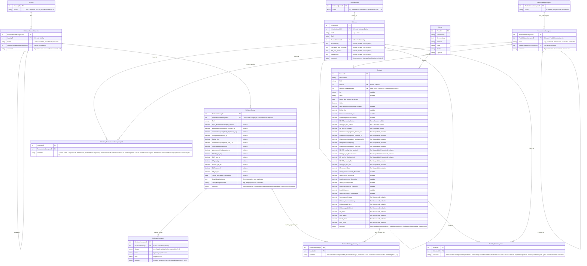

```mermaid
erDiagram

    Katalog {
        int KatalogID PK
        string Name "z.B. Kennwerte 2025 A2, IBO-Richtwerte 2020"
    }

    RichtwertBaumKategorie {
        int RichtwertBaumKategorieID PK
        int KatalogID FK "Refers to Katalog"
        string Name "z.B. Bauprodukte, Abdichtstoffe, Bitumen"
        int ParentRichtwertBaumKategorieID FK "Self-ref for hierarchy"
        string comment "Represents tree structure from richtwerte.md"
    }

    RichtwertEintrag {
        int RichtwertEintragID PK
        int RichtwertBaumKategorieID FK "Links to leaf category in RichtwertBaumKategorie"
        string Titel
        decimal Spez_Waermeleitfaehigkeit_Lambda "nullable"
        decimal Waermedurchgangskoef_Rahmen_Uf "nullable"
        decimal Waermedurchgangskoef_Verglasung_Ug "nullable"
        decimal Energiedurchlassgrad_g "nullable"
        decimal Dichte_rho "nullable"
        decimal Waermedurchgangskoef_Tuer_UD "nullable"
        decimal Diffusionswiderstand_mu "nullable"
        decimal Waermespeicherkapazitaet_c "nullable"
        decimal PENRT_pro_kg "nullable"
        decimal GWP_pro_kg "nullable"
        decimal AP_pro_kg "nullable"
        decimal PENRT_pro_m2 "nullable"
        decimal GWP_pro_m2 "nullable"
        decimal AP_pro_m2 "nullable"
        date Datum_der_letzten_Aenderung "nullable"
        text Detail_Beschreibung "Description when item is selected"
        string Detail_KategorieName "e.g., Bauphysikalische Kennwerte"
        string comment "Attributes vary by RichtwertBaumKategorie type (Bauprodukte, Haustechnik, Prozesse)"
    }

    RichtwertKennwert {
        int RichtwertKennwertID PK
        int RichtwertEintragID FK "Refers to RichtwertEintrag"
        string Gruppe "e.g., Bauphysikalische Kennwerte [cite: 7, 9]"
        string Name "Specific property name"
        string Wert "Property value"
        string comment "Detailed key values for a RichtwertEintrag [cite: 7, 9, 11]"
    }

    KriteriumQuelle {
        int KriteriumQuelleID PK
        string Name "e.g., Österreichische baubook-Plattformen, BNB 1.1.6"
    }

    Kriterium {
        int KriteriumID PK
        int KriteriumQuelleID FK "Refers to KriteriumQuelle"
        string Code "e.g., 1.2.1, 2.2.9"
        string Titel
        int ParentKriteriumID FK "Self-ref for hierarchy"
        text Anforderung "nullable, for leaf criteria [cite: 4]"
        text Nachweis_fuer_Hersteller "nullable, for leaf criteria [cite: 4]"
        text Ziel_und_Nutzen "nullable, for leaf criteria [cite: 4]"
        text Verwendung "nullable, for leaf criteria [cite: 4]"
        string comment "Represents tree structure from kriterien.md [cite: 3]"
    }

    ProduktHauptkategorie {
        int ProduktHauptkategorieID PK
        string Name "Aufbauten, Bauprodukte, Haustechnik"
    }

    ProduktUnterkategorie {
        int ProduktUnterkategorieID PK
        int ProduktHauptkategorieID FK "Refers to ProduktHauptkategorie"
        string Name "e.g., Flachdach, Dämmstoffe aus nachw. Rohstoffen"
        int ParentProduktUnterkategorieID FK "Self-ref for hierarchy"
        string comment "Represents tree structure from produkt.md"
    }

    Firma {
        int FirmaID PK
        string Firmenname
        text Beschreibung
        string Adresse
        string Email
        string Telefon
        string LogoURL
    }

    Produkt {
        int ProduktID PK
        string Produktindex
        string Titel
        int FirmaID FK "Refers to Firma"
        int ProduktUnterkategorieID FK "Links to leaf category in ProduktUnterkategorie"
        string Ort "nullable"
        string Land "nullable"
        date Datum_der_letzten_Aenderung
        boolean IstNeu
        decimal Spez_Waermeleitfaehigkeit_Lambda "nullable"
        decimal Dichte_rho "nullable"
        decimal Diffusionswiderstand_mu "nullable"
        decimal Waermespeicherkapazitaet_c "nullable"
        decimal PENRT_pro_m2_Aufbau "For Aufbauten, nullable"
        decimal GWP_pro_m2_Aufbau "For Aufbauten, nullable"
        decimal AP_pro_m2_Aufbau "For Aufbauten, nullable"
        decimal Waermedurchgangskoef_Fenster_Uw "For Bauprodukte, nullable"
        decimal Waermedurchgangskoef_Rahmen_Uf "For Bauprodukte, nullable"
        decimal Waermedurchgangskoef_Verglasung_Ug "For Bauprodukte, nullable"
        decimal Energiedurchlassgrad_g "For Bauprodukte, nullable"
        decimal Waermedurchgangskoef_Tuer_UD "For Bauprodukte, nullable"
        decimal PENRT_pro_kg_BauHaustech "For Bauprodukte/Haustechnik, nullable"
        decimal GWP_pro_kg_BauHaustech "For Bauprodukte/Haustechnik, nullable"
        decimal AP_pro_kg_BauHaustech "For Bauprodukte/Haustechnik, nullable"
        decimal PENRT_pro_m2_Bau "For Bauprodukte, nullable"
        decimal GWP_pro_m2_Bau "For Bauprodukte, nullable"
        decimal AP_pro_m2_Bau "For Bauprodukte, nullable"
        decimal Anteil_nachwachsende_Rohstoffe "nullable"
        decimal Anteil_fossile_Rohstoffe "nullable"
        decimal Anteil_metallische_Rohstoffe "nullable"
        decimal Anteil_Recyclingstoffe "nullable"
        decimal Anteil_mineralische_Rohstoffe "nullable"
        decimal Anteil_Bitumen "nullable"
        decimal Anteil_halogenorg_Verbindung "nullable"
        decimal Nennwaermeleistung "For Haustechnik, nullable"
        decimal Kleinste_Waermeleistung "For Haustechnik, nullable"
        decimal Wirkungsgrad_Nenn "For Haustechnik, nullable"
        decimal Wirkungsgrad_Kleinst "For Haustechnik, nullable"
        decimal CO_Nenn "For Haustechnik, nullable"
        decimal OGC_Nenn "For Haustechnik, nullable"
        decimal Staub_Nenn "For Haustechnik, nullable"
        decimal NOx_Nenn "For Haustechnik, nullable"
        string comment "Many attributes are specific to ProduktHauptkategorie (Aufbauten, Bauprodukte, Haustechnik)"
    }

    Produkt_Kriterien_Link {
        int ProduktID PK
        int KriteriumID PK
        string comment "Junction Table. Composite PK (ProduktID, KriteriumID). ProduktID is FK to Produkt. KriteriumID is FK to Kriterium. Represents products meeting a criterion [cite: 1] and criteria relevant to a product."
    }

    Kriterium_ProduktUnterkategorie_Link {
        int KriteriumID PK
        int ProduktUnterkategorieID PK
        string comment "Junction Table. Composite PK (KriteriumID, ProduktUnterkategorieID). KriteriumID is FK to Kriterium. ProduktUnterkategorieID is FK to ProduktUnterkategorie. Represents 'Relevante Produktgruppen' for a Kriterium[cite: 2]."
    }

    RichtwertEintrag_Produkt_Link {
        int RichtwertEintragID PK
        int ProduktID PK
        string comment "Junction Table. Composite PK (RichtwertEintragID, ProduktID). Links Richtwerte to Produkte that use them[cite: 7, 12]."
    }

    Katalog ||--o{ RichtwertBaumKategorie : "has"
    RichtwertBaumKategorie }o--|| RichtwertBaumKategorie : "is_parent_of"
    RichtwertBaumKategorie ||--o{ RichtwertEintrag : "contains_entries"
    RichtwertEintrag ||--o{ RichtwertKennwert : "has_key_values"

    KriteriumQuelle ||--o{ Kriterium : "source_for"
    Kriterium }o--|| Kriterium : "is_parent_of"

    ProduktHauptkategorie ||--o{ ProduktUnterkategorie : "has_subcategories"
    ProduktUnterkategorie }o--|| ProduktUnterkategorie : "is_parent_of"
    ProduktUnterkategorie ||--o{ Produkt : "contains_products"
    Firma ||--o{ Produkt : "supplies"

    Produkt ||--o{ Produkt_Kriterien_Link : "links_via"
    Kriterium ||--o{ Produkt_Kriterien_Link : "links_via"

    Kriterium ||--o{ Kriterium_ProduktUnterkategorie_Link : "links_via"
    ProduktUnterkategorie ||--o{ Kriterium_ProduktUnterkategorie_Link : "links_via"

    RichtwertEintrag ||--o{ RichtwertEintrag_Produkt_Link : "applies_to_product_via"
    Produkt ||--o{ RichtwertEintrag_Produkt_Link : "uses_richtwert_via"
```
