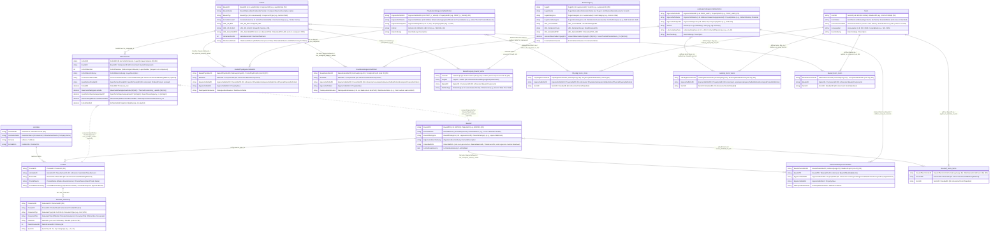

```mermaid
erDiagram

    Norm {
        string NormID "NormID (z.B. EN ISO 10456) / StandardID (e.g., EN ISO 10456) (PK)"
        string NormName "NormName (Vollstaendiger Name der Norm) / StandardName (Full name of standard)"
        string NormVersionDatum "NormVersionDatum (Version oder Datum) / StandardVersion_Date (Version or Date)"
        string Herausgeber "Herausgeber (z.B. ISO, CEN) / IssuingBody (e.g., ISO, CEN)"
        string Beschreibung "Beschreibung / Description"
    }

    Hersteller {
        string HerstellerID "HerstellerID / ManufacturerID (PK)"
        string HerstellerName "HerstellerName (Firmenname) / ManufacturerName (Company Name)"
        string Adresse "Adresse / Address"
        string KontaktInfo "KontaktInfo / ContactInfo"
    }

    Baustoff {
        string BaustoffID "BaustoffID (z.B. BSP001) / MaterialID (e.g., BSP001) (PK)"
        string BaustoffName "BaustoffName (z.B. Brettsperrholz) / MaterialName (e.g., Cross-Laminated Timber)"
        string BaustoffKategorie "BaustoffKategorie (z.B. Lagenwerkstoffe) / MaterialCategory (e.g., Layered Materials)"
        string AllgemeineBeschreibung "AllgemeineBeschreibung / GeneralDescription"
        string DatenblattURL "DatenblattURL (Link zum generischen Materialdatenblatt) / DatasheetURL (Link to generic material datasheet)"
        date LetzteAktualisierung "LetzteAktualisierung / LastUpdated"
    }

    Produkt {
        string ProduktID "ProduktID / ProductID (PK)"
        string HerstellerID "HerstellerID / ManufacturerID (FK referenziert Hersteller/Manufacturer)"
        string BaustoffID "BaustoffID / MaterialID (FK referenziert Baustoff/BuildingMaterial)"
        string ProduktName "ProduktName (Marken-/Handelsname) / ProductName (Brand/Trade Name)"
        string ProduktBeschreibung "ProduktBeschreibung (Spezifische Details) / ProductDescription (Specific details)"
    }

    Zertifikat_Zulassung {
        string DokumentID "DokumentID / DocumentID (PK)"
        string ProduktID "ProduktID / ProductID (FK referenziert Produkt/Product)"
        string DokumentTyp "DokumentTyp (z.B. DoP, ETA) / DocumentType (e.g., DoP, ETA)"
        string DokumentTitel "DokumentTitel (Offizieller Titel des Dokuments) / DocumentTitle (Official title of document)"
        string DateiURL "DateiURL (Link zur PDF-Datei) / FileURL (Link to PDF)"
        int DateiGroesseKB "DateiGroesseKB / FileSize_kB"
        string Sprache "Sprache (z.B. de, en) / Language (e.g., de, en)"
    }

    PhysikalischeEigenschaftsdefinition {
        string EigenschaftsDefID "EigenschaftsDefID (z.B. PROP_U_VALUE) / PropertyDefID (e.g., PROP_U_VALUE) (PK)"
        string EigenschaftsName "EigenschaftsName (z.B. Mittlerer Waermedurchgangskoeffizient U) / PropertyName (e.g., Mean Thermal Transmittance U)"
        string EigenschaftsSymbol "EigenschaftsSymbol (z.B. U, Rw) / PropertySymbol (e.g., U, Rw)"
        string Einheit "Einheit (z.B. W/(m2K), dB) / Unit (e.g., W/(m2K), dB)"
        string Beschreibung "Beschreibung / Description"
    }

    oekologischeEigenschaftsdefinition {
        string EigenschaftsDefID "EigenschaftsDefID (z.B. PROP_GWP) / PropertyDefID (e.g., PROP_GWP) (PK)"
        string EigenschaftsName "EigenschaftsName (z.B. Globales Erwaermungspotenzial) / PropertyName (e.g., Global Warming Potential)"
        string EigenschaftsSymbol "EigenschaftsSymbol (z.B. GWP, AP) / PropertySymbol (e.g., GWP, AP)"
        string Einheit "Einheit (z.B. kg CO2 AEqv.) / Unit (e.g., kg CO2 Aqv.)"
        string Lebenszyklusphase "Lebenszyklusphase (z.B. A1-A3) / LifeCyclePhaseScope (e.g., A1-A3)"
        string Beschreibung "Beschreibung / Description"
    }

    Bauteil {
        string BauteilID "BauteilID (z.B. awmhhi01a) / ComponentID (e.g., awmhhi01a) (PK)"
        string BauteilName "BauteilName (Beschreibender Name) / ComponentName (Descriptive name)"
        string BauteilTyp "BauteilTyp (z.B. Aussenwand) / ComponentType (e.g., Exterior Wall)"
        string KonstruktionsArt "KonstruktionsArt (z.B. Holzrahmen/Holztafel) / ConstructionType (e.g., Timber Frame)"
        string URL_3D_Bild "URL_3D_Bild / Image3D_URL"
        string URL_2D_Schnitt "URL_2D_Schnitt / Image2D_Section_URL"
        string URL_DatenblattPDF "URL_DatenblattPDF (Link zum Bauteil-PDF) / DatasheetPDF_URL (Link to component PDF)"
        int VariantenAnzahl "VariantenAnzahl / NumberOfVariants"
        string FilterbareAttribute "FilterbareAttribute (JSON/Text Array fuer Filter) / FilterableAttributes (JSON/Text Array for filters)"
    }

    Bauteilschicht {
        string SchichtID "SchichtID (ID der Schichtinstanz) / LayerID (Layer Instance ID) (PK)"
        string BauteilID "BauteilID / ComponentID (FK referenziert Bauteil/Component)"
        int SchichtNummer "SchichtNummer (Reihenfolge im Bauteil) / LayerNumber (Sequence in component)"
        string SchichtBeschreibung "SchichtBeschreibung / LayerDescription"
        string GenerischerBaustoffID "GenerischerBaustoffID / GenericMaterialID (FK referenziert Baustoff/BuildingMaterial, optional)"
        string SpezifischesProduktID "SpezifischesProduktID / SpecificProductID (FK referenziert Produkt/Product, optional)"
        decimal DickeMM "DickeMM / Thickness_mm"
        decimal WaermeleitfaehigkeitLambda "WaermeleitfaehigkeitLambda (W/(mK)) / ThermalConductivity_Lambda (W/(mK))"
        decimal SpezifischeWaermekapazitaetCP "SpezifischeWaermekapazitaetCP (kJ/(kgK)) / SpecificHeatCapacity_cp (kJ/(kgK))"
        decimal WasserdampfdiffusionswiderstandMU "WasserdampfdiffusionswiderstandMU / WaterVapourDiffusionResistance_mu"
        decimal RohdichteRHO "RohdichteRHO (kg/m3) / BulkDensity_rho (kg/m3)"
    }

    BauteilPhysEigenschaftsWert {
        string BauteilPhysWertID "BauteilPhysWertID (Verknuepfungs-ID) / CompPhysPropID (Link ID) (PK)"
        string BauteilID "BauteilID / ComponentID (FK referenziert Bauteil/Component)"
        string EigenschaftsDefID "EigenschaftsDefID / PropertyDefID (FK referenziert PhysikalischeEigenschaftsdefinition/PhysicalPropertyDefinition)"
        string EigenschaftsWert "EigenschaftsWert / PropertyValue"
        string DatenquellenHinweise "DatenquellenHinweise / DataSourceNotes"
    }

    BauteiloekoEigenschaftsWert {
        string BauteiloekoWertID "BauteiloekoWertID (Verknuepfungs-ID) / CompEcoPropID (Link ID) (PK)"
        string BauteilID "BauteilID / ComponentID (FK referenziert Bauteil/Component)"
        string EigenschaftsDefID "EigenschaftsDefID / PropertyDefID (FK referenziert oekologischeEigenschaftsdefinition/EcologicalPropertyDefinition)"
        string EigenschaftsWert "EigenschaftsWert / PropertyValue"
        string DatenquellenHinweise "DatenquellenHinweise (z.B. von baubook via Eco2Soft) / DataSourceNotes (e.g., from baubook via Eco2Soft)"
    }

    BaustoffoekoEigenschaftsWert {
        string BaustoffoekoWertID "BaustoffoekoWertID (Verknuepfungs-ID) / MatEcoPropID (Link ID) (PK)"
        string BaustoffID "BaustoffID / MaterialID (FK referenziert Baustoff/BuildingMaterial)"
        string EigenschaftsDefID "EigenschaftsDefID / PropertyDefID (FK referenziert oekologischeEigenschaftsdefinition/EcologicalPropertyDefinition)"
        string EigenschaftsWert "EigenschaftsWert / PropertyValue"
        string DatenquellenHinweise "DatenquellenHinweise / DataSourceNotes"
    }

    Bauteilfuegung {
        string FugeID "FugeID (z.B. awmxsom01) / JointID (e.g., awmxsom01) (PK)"
        string FugenName "FugenName (Beschreibender Name fuer Fuge) / JointName (Descriptive name for joint)"
        string FugenKategorie "FugenKategorie (z.B. Aussenwand) / JointCategory (e.g., Exterior Wall)"
        string FugenUnterkategorie "FugenUnterkategorie (z.B. Wandknoten Aussenwand) / JointSubCategory (e.g., Wall Node Ext. Wall)"
        string URL_Vorschaubild "URL_Vorschaubild / ThumbnailImageURL"
        string URL_Detailzeichnung "URL_Detailzeichnung / DetailDrawingURL"
        string URL_DatenblattPDF "URL_DatenblattPDF / DatasheetPDF_URL"
        decimal LinearerWaermedurchgangPsi "LinearerWaermedurchgangPsi (W/(mK)) / LinearThermalTransmittance_Psi (W/(mK))"
        string Konstruktionshinweise "Konstruktionshinweise / ConstructionNotes"
    }

    Bauteilfuegung_Bauteil_Verkn {
        string VerknID "VerknID (Fuge-Bauteil Verknuepfungs-ID) / LinkID (Joint-Component Link ID) (PK)"
        string FugeID "FugeID / JointID (FK referenziert Bauteilfuegung/ComponentJoint)"
        string BauteilID "BauteilID / ComponentID (FK referenziert Bauteil/Component)"
        string RolleInFuge "RolleInFuge (z.B. Aussenwand, Decke) / RoleInJoint (e.g., Exterior Wall, Floor Slab)"
    }

    PhysEig_Norm_Verkn {
        string PhysEigNormVerknID "PhysEigNormVerknID (Verknuepfungs-ID) / PhysPropStandardLinkID (Link ID) (PK)"
        string EigenschaftsDefID "EigenschaftsDefID / PropertyDefID (FK referenziert PhysikalischeEigenschaftsdefinition/PhysicalPropertyDefinition)"
        string NormID "NormID / StandardID (FK referenziert Norm/Standard)"
    }

    oekoEig_Norm_Verkn {
        string oekoEigNormVerknID "oekoEigNormVerknID (Verknuepfungs-ID) / EcoPropStandardLinkID (Link ID) (PK)"
        string EigenschaftsDefID "EigenschaftsDefID / PropertyDefID (FK referenziert oekologischeEigenschaftsdefinition/EcologicalPropertyDefinition)"
        string NormID "NormID / StandardID (FK referenziert Norm/Standard)"
    }

    Bauteil_Norm_Verkn {
        string BauteilNormVerknID "BauteilNormVerknID (Verknuepfungs-ID) / CompStandardLinkID (Link ID) (PK)"
        string BauteilID "BauteilID / ComponentID (FK referenziert Bauteil/Component)"
        string NormID "NormID / StandardID (FK referenziert Norm/Standard)"
    }

    Baustoff_Norm_Verkn {
        string BaustoffNormVerknID "BaustoffNormVerknID (Verknuepfungs-ID) / MatStandardLinkID (Link ID) (PK)"
        string BaustoffID "BaustoffID / MaterialID (FK referenziert Baustoff/BuildingMaterial)"
        string NormID "NormID / StandardID (FK referenziert Norm/Standard)"
    }

    Hersteller ||--o{ Produkt : "bietet an / offers"
    Baustoff ||--o{ Produkt : "ist Typ fuer / is_type_for"

    Produkt ||--o{ Zertifikat_Zulassung : "hat / has_certificates"

    Bauteil ||--o{ Bauteilschicht : "besteht aus / is_composed_of"
    Bauteilschicht }o..|| Baustoff : "verwendet generischen Baustoff (optional) / uses_generic_material (optional)"
    Bauteilschicht }o..|| Produkt : "verwendet spezifisches Produkt (optional) / uses_specific_product (optional)"

    Bauteil }o--|{ Bauteilfuegung_Bauteil_Verkn : "ist Teil von Verbindung / participates_in_joint"
    Bauteilfuegung ||--|{ Bauteilfuegung_Bauteil_Verkn : "verbindet ueber / connects_through_link"

    PhysikalischeEigenschaftsdefinition }o--|{ PhysEig_Norm_Verkn : "definiert durch Norm via / defined_by_standard_via_link"
    Norm ||--|{ PhysEig_Norm_Verkn : "definiert phys. Eig. via / defines_phys_prop_via_link"

    oekologischeEigenschaftsdefinition }o--|{ oekoEig_Norm_Verkn : "definiert durch Norm via / defined_by_standard_via_link"
    Norm ||--|{ oekoEig_Norm_Verkn : "definiert oeko. Eig. via / defines_eco_prop_via_link"

    Bauteil }o--|{ Bauteil_Norm_Verkn : "erfuellt Norm via / meets_standard_via_link"
    Norm ||--|{ Bauteil_Norm_Verkn : "gilt fuer Bauteil via / applies_to_component_via_link"

    Baustoff }o--|{ Baustoff_Norm_Verkn : "erfuellt Norm via / meets_standard_via_link"
    Norm ||--|{ Baustoff_Norm_Verkn : "gilt fuer Baustoff via / applies_to_material_via_link"

    Bauteil ||--o{ BauteilPhysEigenschaftsWert : "hat phys. Eigenschaftswerte / has_physical_property_values"
    PhysikalischeEigenschaftsdefinition ||--o{ BauteilPhysEigenschaftsWert : "definiert Wert fuer Bauteil / defines_value_for_component"

    Bauteil ||--o{ BauteiloekoEigenschaftsWert : "hat oeko. Eigenschaftswerte / has_ecological_property_values"
    oekologischeEigenschaftsdefinition ||--o{ BauteiloekoEigenschaftsWert : "definiert Wert fuer Bauteil / defines_value_for_component"

    Baustoff ||--o{ BaustoffoekoEigenschaftsWert : "hat oeko. Eigenschaftswerte / has_ecological_property_values"
    oekologischeEigenschaftsdefinition ||--o{ BaustoffoekoEigenschaftsWert : "definiert Wert fuer Baustoff / defines_value_for_material"
```
