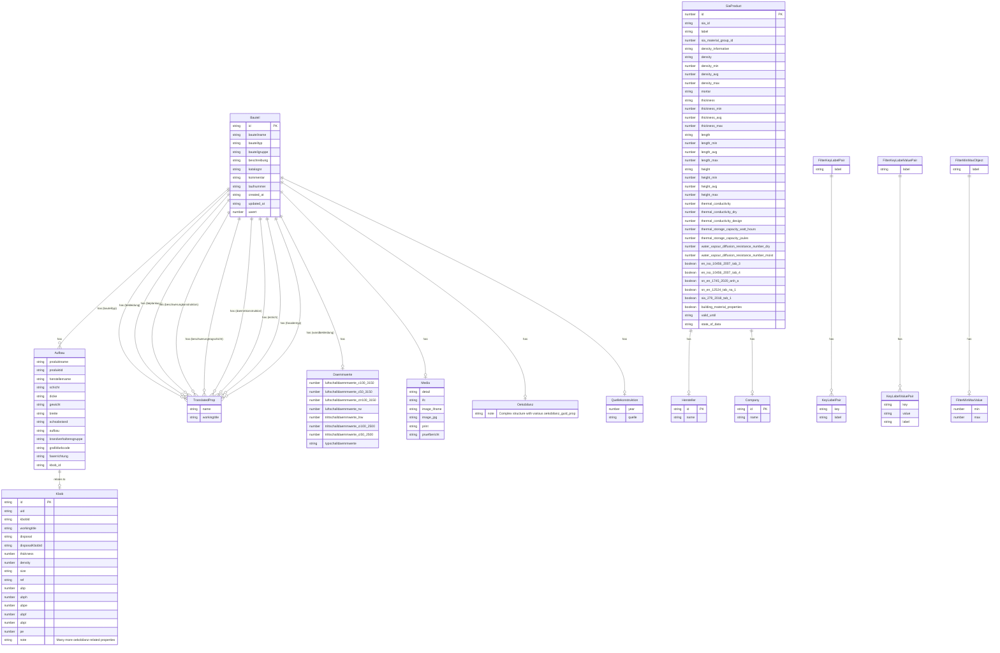

```mermaid
erDiagram
    Bauteil {
        string id PK
        string bauteilname
        string bauteiltyp
        string bauteilgruppe
        string beschreibung
        string katalognr
        string kommentar
        string laufnummer
        string created_at
        string updated_at
        number uwert
    }

    Aufbau {
        string produktname
        string produktid
        string herstellername
        string schicht
        string dicke
        string gewicht
        string breite
        string achsabstand
        string aufbau
        string brandverhaltensgruppe
        string grafikfarbcode
        string faserrichtung
        string kbob_id
    }

    TranslatedProp {
        string name
        string workingtitle
    }

    Daemmwerte {
        number luftschalldaemmwerte_c100_3150
        number luftschalldaemmwerte_c50_3150
        number luftschalldaemmwerte_ctr100_3150
        number luftschalldaemmwerte_rw
        number trittschalldaemmwerte_lnw
        number trittschalldaemmwerte_ci100_2500
        number trittschalldaemmwerte_ci50_2500
        string typschalldaemmwerte
    }

    Media {
        string detail
        string ifc
        string image_iframe
        string image_jpg
        string print
        string pruefbericht
    }

    Oekobilanz {
        string note "Complex structure with various oekobilanz_guid_prop"
    }

    Quellekonstruktion {
        number year
        string quelle
    }

    SiaProduct {
        number id PK
        string sia_id
        string label
        number sia_material_group_id
        string density_informative
        string density
        number density_min
        number density_avg
        number density_max
        string mortar
        string thickness
        number thickness_min
        number thickness_avg
        number thickness_max
        string length
        number length_min
        number length_avg
        number length_max
        string height
        number height_min
        number height_avg
        number height_max
        number thermal_conductivity
        number thermal_conductivity_dry
        number thermal_conductivity_design
        number thermal_storage_capacity_watt_hours
        number thermal_storage_capacity_joules
        number water_vapour_diffusion_resistance_number_dry
        number water_vapour_diffusion_resistance_number_moist
        boolean en_iso_10456_2007_tab_3
        boolean en_iso_10456_2007_tab_4
        boolean sn_en_1745_2020_anh_a
        boolean sn_en_12524_tab_na_1
        boolean sia_279_2018_tab_1
        boolean building_material_properties
        string valid_until
        string state_of_data
    }

    Hersteller {
        string id PK
        string name
    }

    Company {
        string id PK
        string name
    }

    Kbob {
        string id PK
        string uid
        string kbobId
        string workingtitle
        string disposal
        string disposalKbobId
        number thickness
        number density
        string size
        string ref
        number ubp
        number ubph
        number ubpe
        number ubpf
        number ubpi
        number pe
        string note "Many more oekobilanz-related properties"
    }

    FilterKeyLabelPair {
        string label
    }

    KeyLabelPair {
        string key
        string label
    }

    FilterKeyLabelValuePair {
        string label
    }

    KeyLabelValuePair {
        string key
        string value
        string label
    }

    FilterMinMaxValue {
        number min
        number max
    }

    FilterMinMaxObject {
        string label
    }


    Bauteil ||--o{ Aufbau : "has"
    Bauteil ||--o{ TranslatedProp : "has (bauteiltyp)"
    Bauteil ||--o{ TranslatedProp : "has (bekleidung)"
    Bauteil ||--o{ TranslatedProp : "has (beplankung)"
    Bauteil ||--o{ TranslatedProp : "has (beschwerungkonstruktion)"
    Bauteil ||--o{ TranslatedProp : "has (beschwerungtragschicht)"
    Bauteil ||--o{ TranslatedProp : "has (daemmkonstruktion)"
    Bauteil ||--o{ TranslatedProp : "has (estrich)"
    Bauteil ||--o{ TranslatedProp : "has (fasadentyp)"
    Bauteil ||--o{ TranslatedProp : "has (wandbekleidung)"
    Bauteil ||--o| Daemmwerte : "has"
    Bauteil ||--o| Media : "has"
    Bauteil ||--o| Oekobilanz : "has"
    Bauteil ||--o| Quellekonstruktion : "has"
    SiaProduct ||--o| Hersteller : "has"
    SiaProduct ||--o| Company : "has"
    FilterKeyLabelPair ||--o{ KeyLabelPair : "has"
    FilterKeyLabelValuePair ||--o{ KeyLabelValuePair : "has"
    FilterMinMaxObject ||--o| FilterMinMaxValue : "has"
    Aufbau ||--o| Kbob : "relates to"
```
